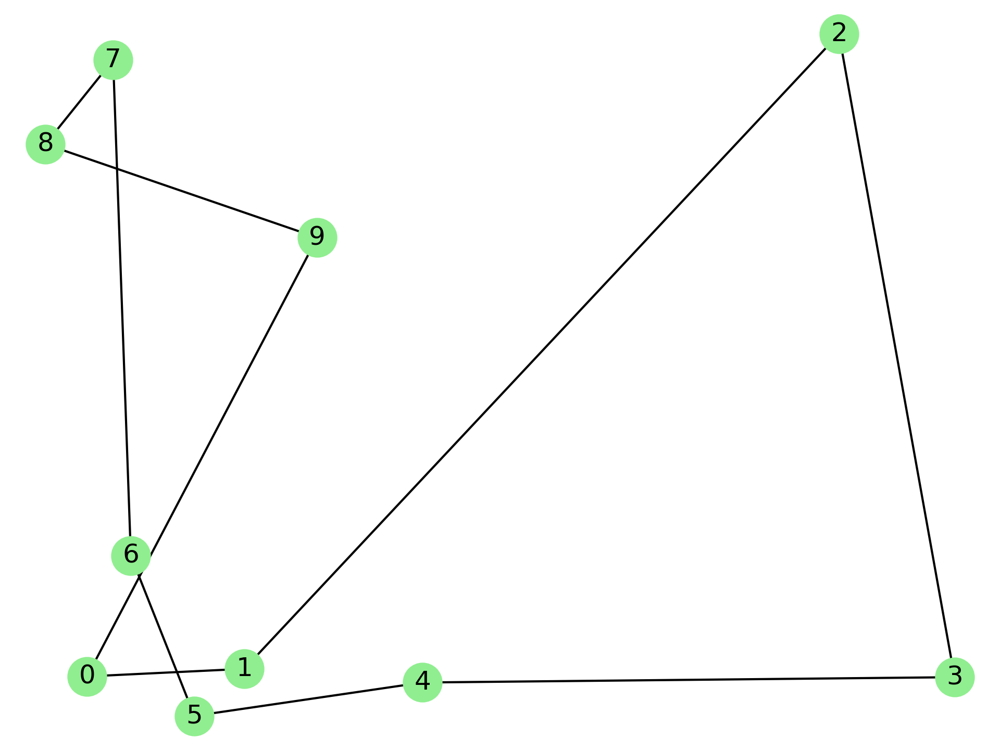

# CSV to Graph

## Description

In this repository, there is an implementation of *CSV* to *Graph (V, E)* transform using `Python 3.8` . The repository was created to validate the results of some TSP algorithms. The algorithms can be found at [this](https://github.com/andreasceid/tsp) repository. The input of the program is a number of CSV files that end with a positive integer number. The program then orders in ascending order the filenames and exports PNG images that represent a graph based on each parsed CSV file. Those images can be then converted in a GIF file using a simple script found in [this](https://github.com/andreasceid/k-means/tree/master/png2gif) git directory.

## Installation

* Open a Terminal
* Change to Project directory
* Execute `pip install -r requirements.txt`

## Setup 

* Create a directory `data` inside the Project directory
* Place all `graph.csv` files in `./data`
* Create a directory `output` inside the Project directory

## Notes

The filename of the input data must follow the format **graph[x]** where `x` is any natural number including 0. The input files must have 2 columns of integers and no headers. The input files must be of CSV file type.

## Results

After its execution, the program saves its results into `./output` directory. The results will be PNG files and the ammount of those files is equal to the number of input files. An example PNG file output by the program is attached below:

